<!-- ================= HERO BANNER (animated amber terminal boot) ================= -->

  

<!-- ================= TERMINAL TYPING LINE ================= -->

  

<!-- ================= STATUS BADGES ================= -->

  
  
  
  

<!-- ================= ABOUT ================= -->


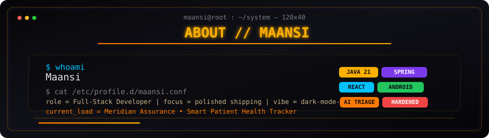

<!-- ================= TECH STACK ================= -->


**`$ languages/`**

**`$ backend_and_frameworks/`**

**`$ frontend_and_mobile/`**

**`$ databases/`**

**`$ tools_and_deploy/`**

  
  
  
  
  
  

  
  
  
  

<!-- ================= FEATURED PROJECTS — HACKER DASHBOARD ================= -->


$ ps aux --sort=-relevance &nbsp;·&nbsp; live snapshot of real GitHub projects, shipped work, and active builds

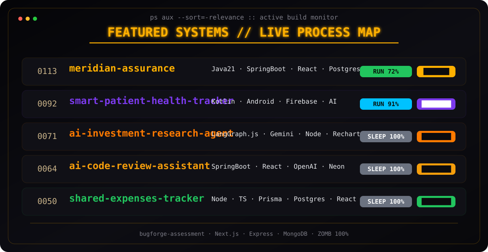

  
  
  
  

<table>
<tr>
<td><strong>01</strong></td>
<td><a href="https://github.com/maansi1/Smart-Health-Tracker"><strong>Smart Health Tracker with AI & Emergency Support</strong></a> Kotlin · Jetpack Compose · Room · MVVM</td>
<td></td>
<td>AI health assistant, reminders, SOS support, and health analytics.</td>
</tr>
<tr>
<td><strong>02</strong></td>
<td><a href="https://github.com/maansi1/EcoTrack-Smart-Waste-Segregation-Sanitization-Management-System"><strong>EcoTrack Smart Waste Segregation</strong></a> Laravel · Blade · PHP · CSS</td>
<td></td>
<td>Waste segregation and sanitization management with a clean Laravel stack.</td>
</tr>
<tr>
<td><strong>03</strong></td>
<td><a href="https://github.com/maansi1/Energy-Tracker---Sustainable-energy"><strong>Energy Tracker Frontend</strong></a> React · Vite · Tailwind CSS</td>
<td></td>
<td>Sustainable energy usage tracking with dashboards, roles, and reports.</td>
</tr>
<tr>
<td><strong>04</strong></td>
<td><a href="https://github.com/maansi1/LensCare"><strong>LensCare</strong></a> PHP · HTML · CSS · JavaScript</td>
<td></td>
<td>Older web application with multiple pages and a classic full-stack layout.</td>
</tr>
<tr>
<td><strong>05</strong></td>
<td><a href="https://github.com/maansi1/Memory_DB"><strong>Memory-DB</strong></a> Java · CLI · TTL cleanup</td>
<td></td>
<td>Command-line mini database with TTL expiry, cleanup, and control commands.</td>
</tr>
<tr>
<td><strong>06</strong></td>
<td><a href="https://github.com/maansi1/SocialMedia_Project"><strong>Social Media Backend API</strong></a> Spring Boot · PostgreSQL · JPA</td>
<td></td>
<td>REST API for posts, comments, likes, and follower relationships.</td>
</tr>
</table>

$ htop --featured-projects &nbsp;·&nbsp; real repo links are wired in, and the colors are there to make the section pop

<!-- ================= STATS ================= -->


  
  

  
  
  

<table>
<tr>
<td></td>
<td></td>
<td></td>
<td></td>
<td></td>
</tr>
</table>

  
  
  

$ monitor --stats --trophies &nbsp;·&nbsp; third-party cards can rate-limit, so hard-refresh if the telemetry looks stale

> **`$ debug streak_card`** — if it still shows 0 / empty: GitHub → Settings → Profile → enable **"Include private contributions on my profile"**. The streak service only sees what your public contribution graph shows.

<!-- ================= CONTRIBUTION GRAPH ================= -->


  

  

$ snake.sh — requires a one-time GitHub Action, see setup notes below.

<!-- ================= SYSTEM DESIGN BLUEPRINT ================= -->


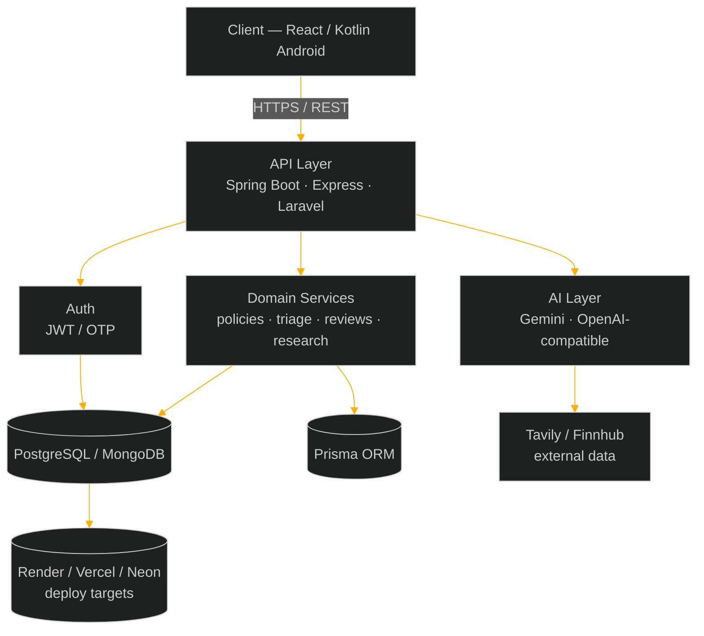

$ note — GitHub renders Mermaid natively, styled here in the same amber terminal palette as the rest of the profile.

<!-- ================= FOOTER (animated amber terminal close) ================= -->

  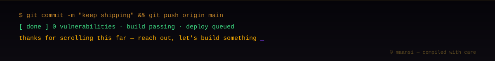

---

### `$ setup.sh` — bootstrap sequence

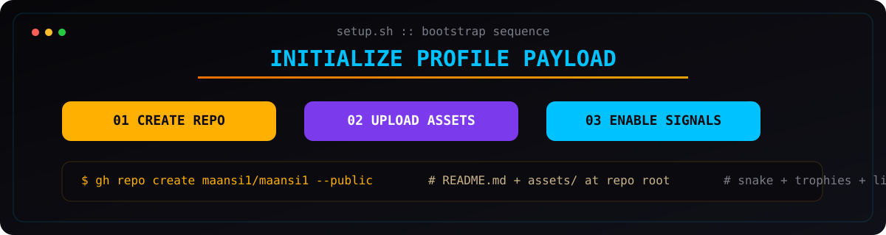

<table>
<tr>
<td>1.</td><td>Keep the repo name exact: <strong>maansi1/maansi1</strong>.</td>
</tr>
<tr>
<td>2.</td><td>Upload <strong>README.md</strong> and the full <strong>assets/</strong> folder together so the SVGs resolve at the repo root.</td>
</tr>
<tr>
<td>3.</td><td>Enable private contributions if your work mostly lives in private repositories.</td>
</tr>
<tr>
<td>4.</td><td>Add the snake workflow under <strong>.github/workflows/</strong> using <strong>Platane/snk</strong>.</td>
</tr>
<tr>
<td>5.</td><td>Replace the placeholder project references with live links once each repo is public.</td>
</tr>
</table>
