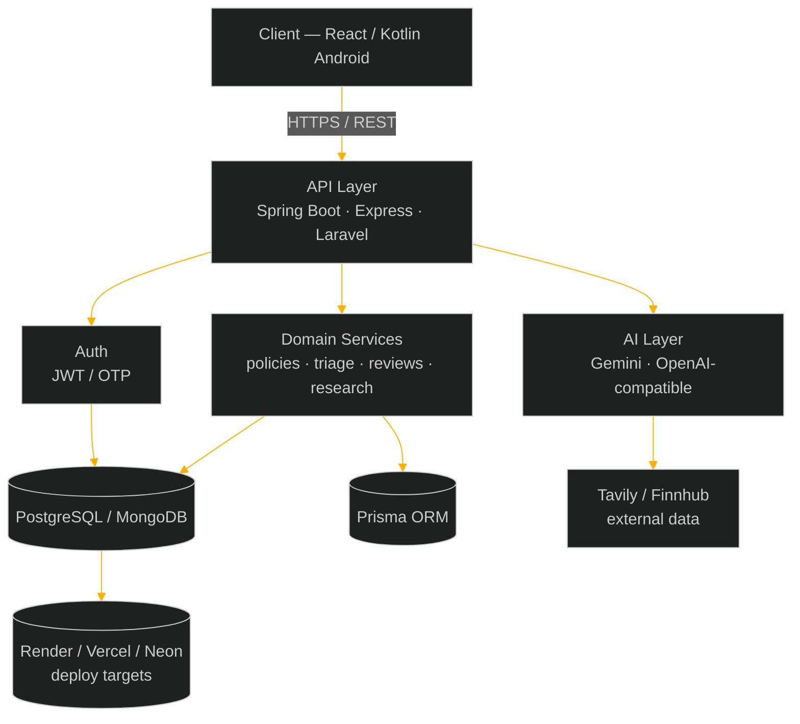

<!-- ================= HERO BANNER (animated amber terminal boot) ================= -->
<p align="center">
  
</p>

<!-- ================= TERMINAL TYPING LINE ================= -->
<p align="center">
  
</p>

<!-- ================= STATUS BADGES ================= -->
<p align="center">
  
  
  
  
</p>


<!-- ================= ABOUT ================= -->
<p align="center"></p>

```bash
$ cat about_me.txt

  name        : Maansi
  role        : Full-Stack Developer (Web + Android)
  focus       : shipping polished, production-shaped side projects
  philosophy  : "Pick the right stack for the problem, not the comfortable one."

  currently_building:
    -> Meridian Assurance : full insurance management platform
                             (Java 21 + Spring Boot + React + PostgreSQL)
    -> Smart Patient Health Tracker : Android app with AI triage
                             + emergency support, multi-role portals

  interests:
    -> Full-stack architecture across MERN / Spring Boot / Kotlin / Laravel
    -> AI-assisted tooling — code review, research agents, health triage
    -> Interface polish: bento grids, motion, dark-mode-first design

$ _
```


<!-- ================= TECH STACK ================= -->
<p align="center"></p>

**`$ languages/`**
<p align="center"></p>

**`$ backend_and_frameworks/`**
<p align="center"></p>

**`$ frontend_and_mobile/`**
<p align="center"></p>

**`$ databases/`**
<p align="center"></p>

**`$ tools_and_deploy/`**
<p align="center"></p>

<p align="center">
  
  
  
  
  
  
</p>
<p align="center">
  
  
  
  
</p>


<!-- ================= FEATURED PROJECTS — HTOP STYLE PROCESS MONITOR ================= -->
<p align="center"></p>

<p align="center"><sub>$ ps aux --sort=-relevance &nbsp;·&nbsp; live snapshot of what's actively being built</sub></p>

```
  PID   PROJECT                          STACK                              STAT   PROGRESS
  ────  ───────────────────────────────  ─────────────────────────────────  ─────  ─────────────────
  0113  meridian-assurance               Java21·SpringBoot·React·Postgres   RUN    ██████████░░░░  72%
        └─ full LIC-style insurance platform · bento-grid dark UI · 3D motion accents

  0092  smart-patient-health-tracker     Kotlin·Android·Firebase·AI         RUN    █████████████░  91%
        └─ AI triage + emergency support · multi-role portals · submission-ready

  0071  ai-investment-research-agent     LangGraph.js·Gemini·Node·Recharts  SLEEP  ██████████████  100%
        └─ 7-node research pipeline · Tavily search · Finnhub live data · PDF export

  0064  ai-code-review-assistant         SpringBoot·React·OpenAI·Neon       SLEEP  ██████████████  100%
        └─ JWT auth · async review pipeline · Checkstyle/PMD static analysis

  0050  shared-expenses-tracker          Node·TS·Prisma·Postgres·React      SLEEP  ██████████████  100%
        └─ CSV import + anomaly detection · greedy debt simplification engine

  0037  bugforge-assessment              Next.js·Express·MongoDB            ZOMB   ██████████████  100%
        └─ 9 defects patched — security, access control, deploy config
```

<table align="center">
<tr>
<td width="50%" valign="top">

```
$ tail -f meridian-assurance.log
```
**🛡️ Meridian Assurance**
Full-stack insurance management platform modeled on a real insurer's product line.
- Java 21 + Spring Boot backend, React front end
- Bento-grid dark UI with 3D motion accents
- Multi-product policy, claims & agent workflows

`Java 21` `Spring Boot` `React` `PostgreSQL`

</td>
<td width="50%" valign="top">

```
$ tail -f health-tracker.log
```
**🩺 Smart Patient Health Tracker**
Android app pairing everyday vitals tracking with AI-assisted triage.
- AI-driven symptom triage & emergency support
- Multi-role portals (patient / caregiver / responder)
- Submission-ready product documentation

`Kotlin` `Android` `Firebase` `AI`

</td>
</tr>
<tr>
<td width="50%" valign="top">

```
$ tail -f research-agent.log
```
**📈 AI Investment Research Agent**
7-node LangGraph.js pipeline built for an AI Labs internship assignment.
- Gemini 2.5 Flash reasoning, Tavily web search
- Live market data via Finnhub, Recharts visuals
- PDF export + side-by-side company comparison

`LangGraph.js` `Gemini` `Node.js` `Recharts`

</td>
<td width="50%" valign="top">

```
$ tail -f code-review-assistant.log
```
**🔍 AI Code Review Assistant**
Spring Boot + React review engine built for an internship assignment.
- JWT auth, async review pipeline
- Checkstyle / PMD / JavaParser static analysis
- OpenAI-compatible review service, Neon deploy

`Spring Boot` `React` `OpenAI API` `Neon`

</td>
</tr>
</table>


<!-- ================= STATS ================= -->
<p align="center"></p>

<p align="center">
  
  
</p>
<p align="center">
  
</p>

<sub>$ note — trophy/stats cards are free third-party services (Vercel-hosted) and occasionally rate-limit or go down for a few minutes. If a card shows broken here, right-click → open the image URL directly in a new tab: if that also fails, it's the service being down, not your repo — just wait and hard-refresh later. If it loads fine standalone but not on GitHub, it's GitHub's ~30min image cache — hard-refresh (Cmd+Shift+R) fixes it.</sub>

> **`$ debug streak_card`** — if it still shows 0 / empty: GitHub → Settings → Profile → enable **"Include private contributions on my profile"**. The streak service only sees what your public contribution graph shows. GitHub also caches these images ~30 min via its proxy, so hard-refresh after fixing.

<!-- ================= CONTRIBUTION GRAPH ================= -->
<p align="center"></p>

<p align="center">
  
</p>

<p align="center">
  
</p>
<p align="center"><sub>$ snake.sh — requires a one-time GitHub Action, see setup notes below.</sub></p>


<!-- ================= SYSTEM DESIGN BLUEPRINT ================= -->
<p align="center"></p>



<sub>$ note — GitHub renders Mermaid natively, styled here in the same amber terminal palette as the rest of the profile.</sub>

<!-- ================= FOOTER (animated amber terminal close) ================= -->
<p align="center">
  
</p>

---

### `$ setup.sh` — do these once in your repo

1. **Create the special repo (if you haven't).** GitHub profile READMEs only render when the repo name matches your username exactly — create `maansi1/maansi1` if it doesn't exist yet.
2. **Unzip and upload the whole thing.** Extract the zip, then on `github.com/maansi1/maansi1` → **Add file → Upload files** → drag in `README.md` and the entire `assets` folder together, so `assets/banner.svg` etc. sit at the repo root next to the README. Commit directly to `main`.
3. **Fix the streak card**: GitHub → Settings → Profile → enable *"Include private contributions on my profile"* if most of your work is on private repos.
4. **Enable the snake animation**: add a workflow using [`Platane/snk`](https://github.com/Platane/snk) to `.github/workflows/` in this repo — it generates and commits `github-contribution-grid-snake-dark.svg` to an `output` branch, which the snake image above points to.
5. **Swap in real project links** — the featured-project cards above don't have `[View Repo]` links yet; add them once each repo is public, so recruiters can click straight through.
